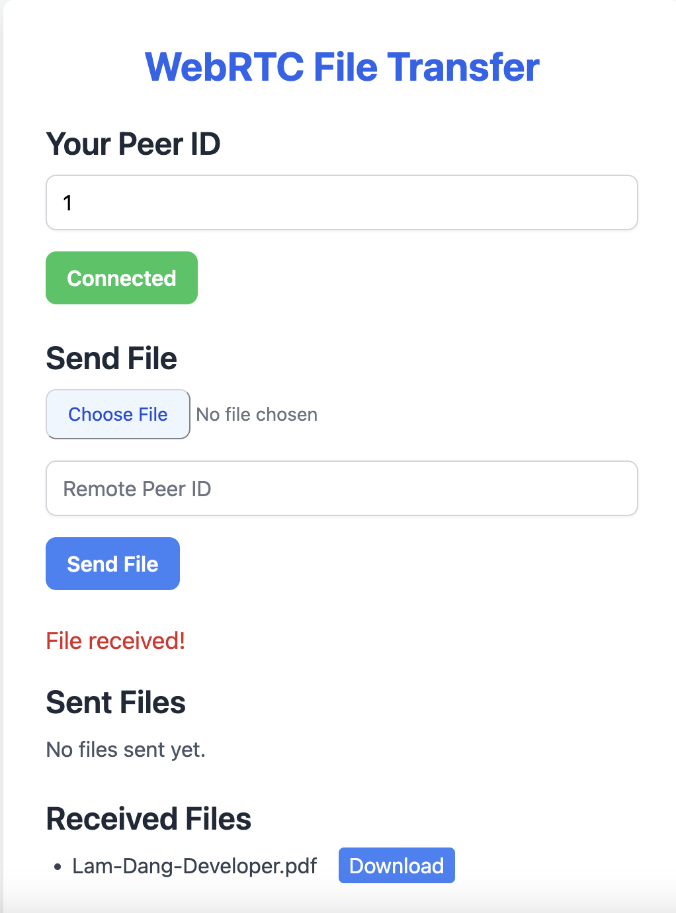

<!-- WebRTC File Transfer

1.open/navigate to folder
cd webrtc-file-transfer

2. Install Dependencies
npm install

3. Run PeerJS Server
npx peerjs --port 9000 --path /

 4. Start the Application
npm run dev

Usage

1. Open Two Browser Tabs
   Open the application in two different browser tabs or windows to simulate two peers.

2. Initialize Peer
   In the first tab:

Enter a Peer ID.
Click "Start Connection" to initialize the peer.

3. Send a File
In the second tab:

Enter the Peer ID from the first tab.
Select a file to send.
Click "Send File".

4. Check Messages
Both tabs will display messages indicating the status of file transfers. Sent and received files will be listed in their respective sections. -->

# WebRTC File Transfer

## Description

-Real-time file sharing between user: reduce latancy
-User receieved file can instantly download
-No need to upload file google drive, or other platform: just send file and download



### Installation

1. Navigate to the project directory:
   ```bash
   cd webrtc-file-transfer
   ```
2. Install dependencies:
   ```bash
   npm install
   ```
3. Set up the server:
   ```bash
   npm install -g peer
   ```
4. Run PeerJS Server
   ```bash
   peerjs --port 9000
   ```
5. Start the Application:
   ```bash
   npm run dev
   ```

## Usage

1. **Open Two Browser Tabs**

   - Open the application in two different browser tabs or windows to simulate two peers.

2. **Initialize Peer**
   In the first tab:

   - Enter a Peer ID.
   - Click "Start Connection" to initialize the peer.

3. **Send a File**
   In the second tab:

   - Enter the Peer ID from the first tab.
   - Select a file to send.
   - Click "Send File".

4. **Check Messages**
   - Both tabs will display messages indicating the status of file transfers.
   - Sent and received files will be listed in their respective sections.
